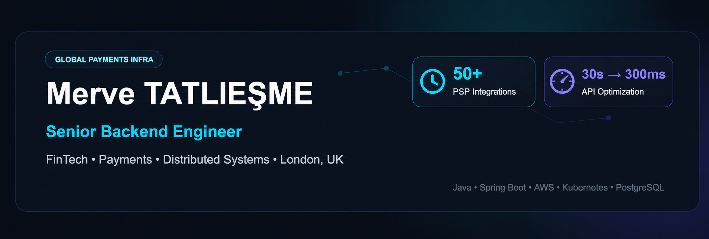

  

  

  
  

---

## About Me

Backend Engineer with 3+ years of experience building fintech products, payment infrastructure, and distributed backend systems in London, UK.

Experienced in designing scalable payment platforms, optimizing high-traffic services, and developing resilient backend systems where reliability, correctness, and performance matter.

---

## Engineering Highlights

| Area | Impact |
|------|--------|
| Payments | Built and integrated payment processing systems |
| Performance | Optimized database queries reducing response time by **40%+** |
| Architecture | Designed and scaled microservices handling millions of transactions |
| Reliability | Developed resilient asynchronous transaction workflows |
| Code Quality | Implemented TDD and clean architecture practices |
| Scalability | Built REST APIs serving **100k+ daily requests** |

---

## Tech Stack

### Backend

### Cloud & DevOps

### Data & Messaging

### Testing & Tools

---

## Currently Interested In

- Payment Infrastructure & FinTech
- Microservices Architecture
- Distributed Systems
- System Design & Scalability
- Event-Driven Architecture
- Cloud-Native Backend Systems
